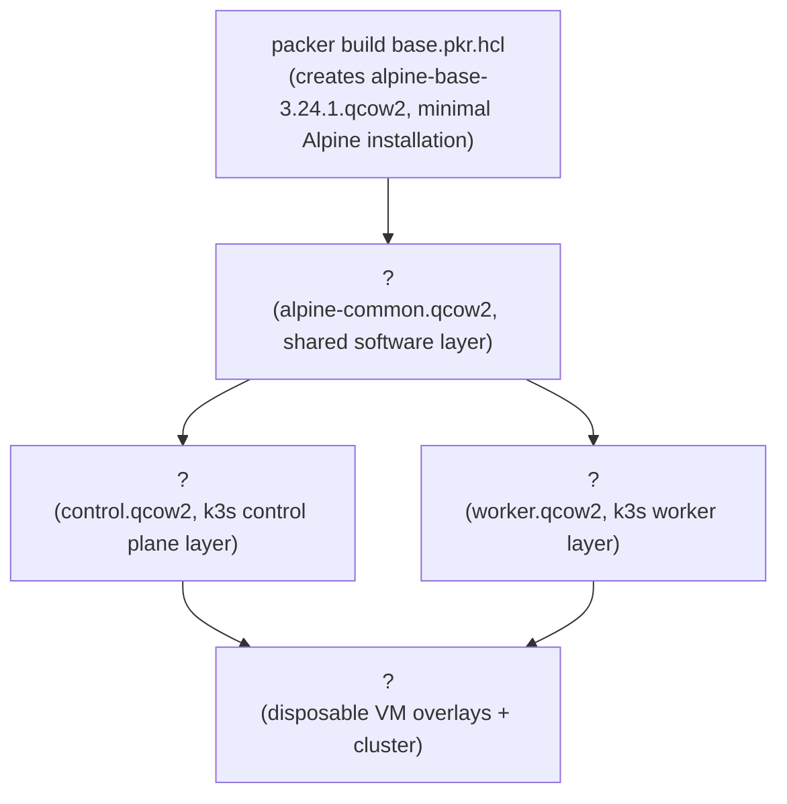

# infra-labs

Image-based VM lab infrastructure using QEMU/libvirt and OpenTofu.

## Architecture

## TODO

- [ ] Introduce Debian with k8s
- [ ] Utilize HCL: SSH keys, variables, etc.
- [ ] Add GPG verification
- [ ] Centralize QEMU vars (RAM, CPUs, disk, NIC) shared by Packer and Terraform
